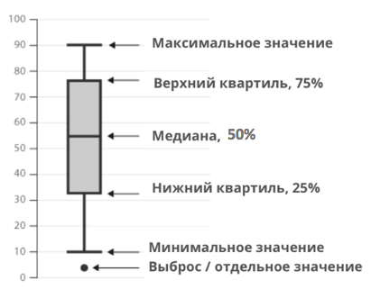

# Программирование на R

### Работа с пакетами

```r
sessionInfo()                                         # Информация о сессии
install.packages("ggplot2")                           # Установка пакета
library(ggplot2)                                      # Подключение пакета
demo(error.catching, package = "base", ask = TRUE)    # Запуск демонстрационного скрипта
vignette()
```

### Помощь

```r
ls(pos = "package:ggplot2")                          # Список объектов в пакете
ls                                                   # Вывод информации об функции и его код
?ls                                                  # Помощь по функции
find("mean")                                         # Поиск функции
example(ls)                                          # Примеры использования функции
```

## Особенности R

- Интерпретируемый и динамический язык программирования
- Основой является S и C
- Расширяемый с помощью пакетов на C, C++, Fortran
- Поддерживает множество графиков
- Имеет интерактивную документацию

## Основа синтаксиса R

- Язык регистрозависимый
- Признаком завершения команды является символ `;` или новая строка
- Для начала и окончания блока кода используются фигурные скобки `{ }`

## Языковые лексемы

- Пробельные символы
- Комментарии
    - Однострочные `#`
- Идентификаторы
    - Состоящие из букв, цифр и символов `_` и `.`
    - Например: `x`, `x1`, `x.y`, `x_y`
- Ключевые слова
    - `if`, `else`, `repeat`, `while`, `function`, `for`, `in`, `next`, `break`
    - `TRUE`, `FALSE`
    - `NULL`, `Inf`, `NaN`, `NA`
    - `NA_integer_`, `NA_real_`, `NA_complex_`, `NA_character_`
- Литералы
    - Числовые. Например: `1`, `1L`, `1.0`, `1.0e-1`, `1.0e+1`, `1.0e1`
    - Строковые. Например: `"abc"`, `'abc'`
    - Логические. Например: `TRUE`, `FALSE`
    - Прочие. Например: `5L`, `4-1i`
- Операции и пунктуация
    - Блок кода `{ }`
    - Индексация `[]`
    - Доступ к членам объекта `.`
    - Разделитель аргументов `,`
    - Последовательность `:`
    - Окончание команды `;`
    - Арифметические операции `+`, `-`, `*`, `/`, `^`, `%%`, `%/%`
    - Логические операции `!`, `&`, `|`, `&&`, `||`
    - Операции сравнения `==`, `!=`, `<`, `<=`, `>`, `>=`
    - Операции присваивания `<-`, `=`, `->`, `->>`, `<<-`
    - Операторы пакетов `%whatever%`. Например: `%in%`, `%*%`, `%x%`, `%o%`

## Система типов

- Что угодно в R является объектом
- Внутренний тип устанавливается автоматически R. Его можно узнать через функцию `typeof()`
- Распространённые команды для управления объектами:
    - `objects(name, pos = -1L, envir = as.environment(pos), all.names = FALSE, pattern, sorted = TRUE)` - список
      объектов в памяти
    - `rm(..., list = character(), pos = -1, envir = as.environment(pos), inherits = FALSE)` - удаление объектов
    - `exists(..., envir = parent.frame(), mode = "any", inherits = TRUE)` - проверка существования объекта
    - `get(..., envir = parent.frame(), mode = "any", inherits = TRUE)` - получение объекта
    - `assign(..., envir = parent.frame(), inherits = TRUE)` - присваивание объекта
- Пользовательские типы данных:
    - Векторы `vector(mode = "logical", length = 0L)`
    - Списки `list(...)`
    - Матрицы `matrix(data = NA, nrow = 1, ncol = 1, byrow = FALSE, dimnames = NULL)`
    - Массивы `array(data = NA, dim = 1L, dimnames = NULL)`
    - Факторы `factor(x, levels = NULL, labels = NULL, exclude = NULL, ordered = FALSE)`
    - Датафреймы `data.frame(...)`

# Векторы

Вектор - это одномерный набор однотипных данных.

Создание вектора:

```r
v <- 1:8
v <- c(4, 7, v)
v <- scan()               # Создание вектора их значений введённых с клавиатуры
v <- numeric(10)          # Создание вектора из 10 элементов типа numeric
v <- seq(1, 7, by = 2)    # Создание вектора из чисел от 1 до 7 с шагом 2
v <- rep(1:3, times = 2)  # Создание вектора из 2 повторений чисел от 1 до 3
```

Работа с вектором:

```r
v[1]                      # Получение первого элемента вектора
v[70] <- 5                # Добавление элемента с индексом 70 в вектор
v[3:5]                    # Получение элементов с 3 по 5
v[c(1, 3)]                # Получение элементов с индексом 1 и 3
v[-c(1, 3)]               # Получение всех элементов кроме элементов с индексом 1 и 3
v[v %% 2 == 0]            # Получение всех чётных элементов вектора
```

Функции для работы с векторами:

```r
sort(v)                   # Сортировка вектора
length(v)                 # Длина вектора
rev(v)                    # Реверс вектора
min(v)                    # Минимальное значение вектора
max(v)                    # Максимальное значение вектора
sum(v)                    # Сумма элементов вектора
mean(v)                   # Среднее значение элементов вектора

which(v > 5)              # Индексы элементов вектора, которые больше 5
which.max(v)              # Индекс максимального элемента вектора

union(v, 1:5)             # Объединение векторов
intersect(v, 1:2)         # Пересечение векторов
setdiff(v, 1:2)           # Разность векторов

rank(v)                   # Ранг элементов вектора
order(v)                  # Индексы элементов вектора, отсортированных по возрастанию
```

## Матрицы

Матрица - это двумерный набор однотипных данных.

Создание матрицы:

```r
m <- 1:6
dim(m) <- c(2, 3)                                   # Указание размерности матрицы

m <- matrix(1:6, nrow = 2, ncol = 3, byrow = TRUE)  # Создание матрицы из 6 элементов размерностью 2 на 3
```

Работа с матрицей:

```r
rowSums(m)                                          # Сумма элементов по строкам
rowMeans(m)                                         # Среднее значение элементов по строкам
colSums(m)                                          # Сумма элементов по столбцам
colMeans(m)                                         # Среднее значение элементов по столбцам

det(m)                                              # Определитель матрицы
ginv(m)                                             # Обратная матрица
cbind(m, 1:2)                                       # Добавление столбца в матрицу
rbind(m, 1:3)                                       # Добавление строки в матрицу
m %*% matrix(1:6, nrow = 3, ncol = 2)               # Умножение матрицы на вектор
```

## Массивы

Массив - это многомерный набор однотипных данных.

Создание массива:

```r
a <- 1:12
dim(a) <- c(2, 3, 2)                                # Указание размерности массива

a <- array(1:24, dim = c(2, 3, 4))                  # Создание массива из 24 элементов размерностью 2 на 3 на 4
```

## Факторы

Фактор (иначе признак) - это набор категориальных данных.

Создание фактора:

```r
f <- c(0, 20, 0, 20, 30, 0, 30)
f <- factor(f)                                      # Создание фактора из вектора

f <- factor(c("a", "b", "a", "b", "c", "a", "c"))   # Создание фактора из вектора строк

levels(f)                                           # Получение уровней фактора
levels(f) <- c(1, 2, 3)                             # Установка уровней фактора
```

## Списки

Список - это набор элементов разных типов.

Создание списка:

```r
l <- list(1, "a", 1:3, matrix(1:6, nrow = 2, ncol = 3)) # Создание списка из 4 элементов
l <- list(a = 1, b = "a", c = 1:3, d = c(1, 2, 3))      # Создание списка из именованных векторов
```

Получение доступа к элементам списка:

```r
l[[1]]                                              # Получение первого элемента списка
l$a                                                 # Получение элемента списка по имени
```

## Датафреймы

Данные в датафрейме представлены в виде таблицы, где строки - это наблюдения, а столбцы - это переменные.

Создание датафрейма:

```r
d <- data.frame(
    name = c("John", "Mary", "Peter"),
    age = c(18, 27, 24)
)                                                   # Создание датафрейма из векторов
d <- read.table("data.txt", header = TRUE)          # Создание датафрейма из файла
```

Работа с датафреймом:

```r
d[1, 1]                                             # Получение элемента датафрейма
d[age > 20,]                                       # Получение строк датафрейма, где значение переменной age больше 20

attach(d)                                           # Прикрепление датафрейма к среде
summary(d)                                          # Получение статистической информации по датафрейму
```

# Ветвление

- `if`
- `ifelse()`
- `switch()`

```r
n <- 7
x <- 3 * if (n > 5) 2 else 1                        # Вычисление значения переменной x с помощью условного оператора
```

```r
if (condition) {
    # code
} else if (condition) {
    # code
} else {
    # code
}
```

```r
v <- 1:4
ifelse(v > 2, "a", "b")                             # Получение вектора значений "a" и "b" в зависимости от условия
```

```r
l <- "R"
switch(l, "R" = 1, "Python" = 2, "Java" = 3)       # Получение значения 1, 2 или 3 в зависимости от значения переменной l
```

# Циклы

- `for`
- `while`
- `repeat`

```r
for (i in 1:10) {
    # code
}
```

```r
n <- 5
while (n > 0) {
    # code
    n <- n - 1
}
```

```r
repeat {
    # code
    break
}
```

Пример функции нахождения максимально элемента вектора:

```r
max <- function(x) {
    m <- x[1]
    for (i in 2:length(x)) {
        if (x[i] > m) {
            m <- x[i]
        }
    }
    return(m)
}
```

# Библиотека `dplyr`

Библиотека `dplyr` предоставляет набор функций для работы с датафреймами. Примеры функций:

- Фильтрация данных: `dplyr::filter(.data, ..., .preserve = FALSE)`. Например, `dplyr::filter(d, age > 20)`
- Сортировка данных: `dplyr::arrange(.data, ..., .na.last = TRUE)`. Например, `dplyr::arrange(d, age)`
- Выборка столбцов: `dplyr::select(.data, ..., .preserve = FALSE)`. Например, `dplyr::select(d, name)`
- Добавление столбцов:
    - `dplyr::mutate(.data, ..., .preserve = FALSE)`. Например, `dplyr::mutate(d, age2 = age * 2)`
    - `dplyr::transmute(.data, ..., .preserve = FALSE)`. Например, `dplyr::transmute(d, age2 = age * 2)`
- Группировка данных: `dplyr::group_by(.data, ..., .add = FALSE)`.
  Например, `dplyr::group_by(d, age) %>% dplyr::summarize(mean_age = mean(age))`

# Функции семейства `*apply`

- `apply(x, MARGIN, FUN, ..., simplify = TRUE)`. Пример: `apply(matrix(1:50, 10, 5), 1, sum)`
    - `x` может быть датафреймом или матрицей
    - `MARGIN` указывает на оси, по которым будет производиться применение функции `FUN`
    - `FUN` - функция, которая будет применена к элементам датафрейма или матрицы
    - Возвращает вектор, если `simplify = FALSE`, то возвращает массив
- `lapply(X, FUN, ...)`. Пример: `lapply(1:10, function(x) x^2)`
    - `X` может быть списком, вектором или матрицей
    - `FUN` - функция, которая будет применена к элементам списка, вектора или матрицы
    - Возвращает список
- `sapply(X, FUN, ..., simplify = TRUE)`. Пример: `sapply(1:10, function(x) x^2)`
    - `X` может быть списком, вектором или матрицей
    - `FUN` - функция, которая будет применена к элементам списка, вектора или матрицы
    - Возвращает вектор, если `simplify = FALSE`, то возвращает массив
- `mapply(FUN, ..., MoreArgs = NULL, SIMPLIFY = TRUE, USE.NAMES = TRUE)`.
  Пример: `mapply(function(x, y) x + y, 1:10, 1:10)`
    - `FUN` - функция, которая будет применена к элементам списков, векторов или матриц
    - `...` - списки, вектора или матрицы
    - `MoreArgs` - список дополнительных аргументов, которые будут переданы в функцию `FUN`
    - `USE.NAMES` - если `TRUE`, то имена элементов списков, векторов или матриц будут использованы в качестве имён
      столбцов в результирующей таблице
    - Возвращает вектор, если `SIMPLIFY = FALSE`, то возвращает массив
- `rapply(object, f, classes = "ANY", deflt = NULL, how = c("unlist", "replace", "list"), ...)`.
  Пример: `rapply(list(1:9, list(10:20)), sum)`
    - `object` - список
    - `f` - функция, которая будет применена к элементам списка
    - `classes` - классы, к которым будут применены функция `f`
    - `deflt` - значение, которое будет возвращено, если элемент не принадлежит классам `classes`
    - `how` - способ применения функции `f` к элементам списка
    - `...` - дополнительные аргументы, которые будут переданы в функцию `f`
    - Возвращает список, вектор или матрицу
- `tapply(X, INDEX, FUN, ..., simplify = TRUE)`. Пример: `tapply(1:10, 1:10 %% 2, sum)`
    - `X` - вектор
    - `INDEX` - вектор, который определяет группы элементов вектора `X`
    - `FUN` - функция, которая будет применена к элементам списка, вектора или матрицы
    - Возвращает вектор, если `simplify = FALSE`, то возвращает массив

# Анализ данных

## Постановка задачи

`x` - множество объектов. `y` - множество ответов. На каждом объекте наблюдаем ряд признаков. `F` - матрица объекты -
признаки.

```txt
print(F)

     [,1]   [,2]   [,3]  [,4]  
[1,] x_11   x_12   ...   x_1k
[2,] x_22   x_22   ...   x_2k
[3,] ...    ...    ...   ... 
[4,] x_n1   x_n2   ...   x_nk
```

### Первый этап «Обучение»

Необходимо получить решающую функцию из результатов исследования.

### Второй этап «Применение»

- Регрессия, т.е. возможность предсказать ответ.
- Классификация.
- Ранжирование, для поисковых систем.
- Генеральная совокупность
- Выборка
- Вариационный ряд
- Статистический ряд
- Таблица частот
- Гистограмма и/или кумулятивное распределение

## Меры центральной тенденции

- Мода - наиболее часто встречающееся значение.
- Медиана - значение, которое делит выборку на две равные части.
- Квартили - значения, которые делят выборку на четыре равные части.
- Среднее арифметическое - сумма всех значений, деленная на их количество. Обозначается математически как x c чертой над
  ним.

## Меры изменчивости

- Размах - разница между максимальным и минимальным значениями.
- Межквартильный размах - разница между третьим и первым квартилем.
- Дисперсия - среднее квадратическое отклонение от среднего арифметического.
- Стандартное отклонение, ошибка

## Диаграмма размаха `boxplot`



Пример:

```r
people <- data.frame(
    Name = c("John", "Mary", "Peter", "Jane", "Mark", "Sue", "Tom", "Alice", "Bob", "Bill"),
    Age = c(23, 25, 27, 29, 31, 33, 35, 37, 39, 41),
    Gender = sample(c("M", "F"), 10, replace = TRUE)
)

boxplot(people$Age ~ people$Gender, main = "Размах возраста", xlab = "Пол", ylab = "Число людей")
```

## Проверка нормальности распределения

- Проверка на нормальность распределения с помощью гистограммы. Например: `hist(people$Age)`.
- Проверка на нормальность распределения с помощью графика квантиль-квантиль (QQ-plot). Например: `qqnorm(people$Age)`
  или `qqline(people$Age)`.
- Проверка на нормальность распределения с помощью критерия Шапиро-Уилка. Например: `shapiro.test(people$Age)`.

## Нахождение доверительного интервала

1. Если знаем дисперсию генеральной совокупности:
    - `c(mean(people$Age) - 1.96 * sd(people$Age) / sqrt(length(people$Age)), mean(people$Age) + 1.96 * sd(people$Age) / sqrt(length(people$Age)))`
2. Если не знаем дисперсию генеральной совокупности:
    - `c(mean(people$Age) - qt(0.975, length(people$Age) - 1) * sd(people$Age) / sqrt(length(people$Age)), mean(people$Age) + qt(0.975, length(people$Age) - 1) * sd(people$Age) / sqrt(length(people$Age)))`

## Регрессионный анализ

Формула регрессии: `y <- a + f(b, x)`

- Простая линейная регрессия: `y <- b0 + b1 * x + a`
- Линейная: `y <- sum(bi * fi(x) + a)`
- Нелинейная: `f(b)` - нелинейная зависимость

### Простая линейная регрессия

1. Строим диаграмму рассеяния и находим коэффициент корреляции:
    - `plot(people$Age, people$Height, main = "Зависимость роста от возраста", xlab = "Возраст", ylab = "Рост")`
    - `cor(people$Age, people$Height)`
2. Находим коэффициенты регрессии с помощью метода наименьших квадратов:
    - `model <- lm(people$Height ~ people$Age)`

### Оценка регрессионной модели

- Коэффициент детерминации: `summary(model)$r.squared`
- Статистика Фишера: `summary(model)$fstatistic`
- Диаграмма остатков: `plot(model)`. Точки должны равномерно заполнять прямоугольник. Если это не так, это не линейная
  зависимость
- Диаграмма остатков с помощью графика квантиль-квантиль (QQ-plot): `qqnorm(model$residuals)`
- Диаграмма проверки однородности дисперсии остатков: `plot(model, 2)`. Если точки расположены в треугольнике, то
  дисперсия остатков однородна

### Линейная регрессия

`y <- sum(bi * fi(x) + a)`, где `j` - номер параметра. Основные проблемы:

- Мультиколлинеарность - сильная корреляция между параметрами
- Переобучение - модель переобучена на обучающей выборке, но не сможет работать на новых данных
- Включение или исключение параметров

## Статистическая проверка гипотез

- Основная гипотеза `H_0` и альтернативная `H_1`
- Уровень значимости `alpha <- 0.05`
- Выбор статистики, то что мы будем использовать для сравнения гипотез
- Определить критические области
- Вычисление статистики и принятие решения

### t критерий Стьюдента

Есть две выборки, проведённых при разных условиях. Если объём выборок больше 30, то надо брать распределение Стьюдента.
Критерий Стьюдента: `t.test(x ~ y)`. Если `p-value` меньше `alpha`, то отвергаем `H_0`. Число степеней
свободы `df <- n_1 + n_2 - 2`.

## Дисперионный анализ

Позволяет дать оценку влияния одного или нескольких факторов на получаемые результаты. Основное тождество дисперсионного
анализа: `Q_t = Q_out + Q_in`. Вычисляется с помощью `anova(model)`. Если `p-value` меньше `alpha`, то отвергаем `H_0`.

